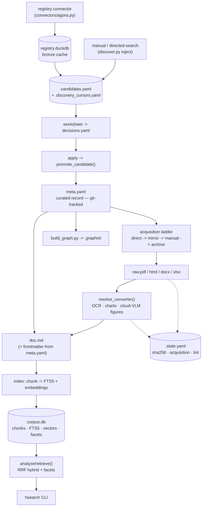
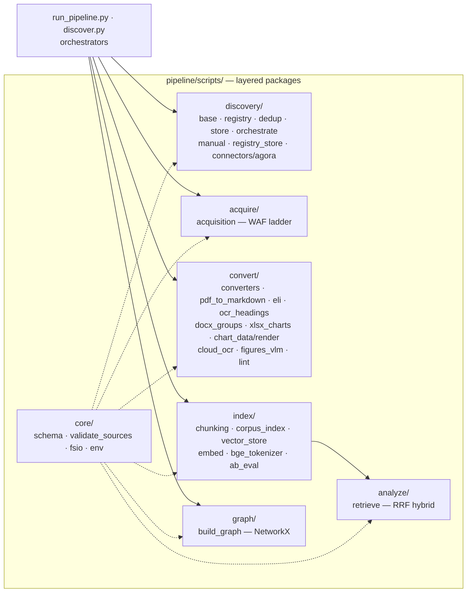

# G2AI_ME

A local, provenance-first pipeline that collects, converts, indexes, and cross-references government and international AI-governance documents for comparative policy analysis. The corpus is oriented toward extracting transferable practices, with an applied focus on material relevant to a draft Montenegro national AI strategy. Independent research project, unaffiliated.

## Pipeline

A URL to a public government or IGO document becomes searchable, structured, provenance-tracked text in a local corpus:

1. **Discovery** — candidate sources via manual entry, reproducible directed-search campaigns, and code connectors to curated registries (first: ETO AGORA).
2. **Triage** — a two-stage relevance gate (metadata, then full text) admits candidates into a curated registry.
3. **Acquisition** — an idempotent, WAF-resilient ladder: direct → official mirror → manual → web archive.
4. **Conversion** — PDF / HTML / DOCX / XLSX → Markdown, with column/heading/table reconstruction, OCR for scans, native-chart data extraction, and an optional cloud vision tier for figures.
5. **Indexing** — canonical chunks → SQLite FTS5 + dense embeddings; hybrid retrieval (reciprocal-rank fusion) with faceted filters; a heterogeneous NetworkX knowledge graph.

Curated metadata (`meta.yaml`, Dublin Core plus light analytics) is versioned in git; document bodies and derived artifacts stay local, and source copyright is treated conservatively.

## Architecture & data flow

Detailed diagrams — click to expand

 

**A document's journey (data flow).** Curated `meta.yaml` is the only git-tracked artifact; everything else stays local.

**Layered packages under `pipeline/scripts/` (code architecture).** The orchestrators drive the layers; `core/` is shared; retrieval reads the index.

## Design constraints

- **Local, CPU-only.** No servers, GPU, or JVM; runs on modest hardware.
- **Provenance-first.** `source_url` is always the official primary source; the pipeline downloads the original document rather than relaying third-party copies.
- **Idempotent reconciliation.** Work is derived from filesystem/registry state, so re-runs are safe and self-healing.
- **API-first embeddings** with a fully local fallback for offline or sensitive material.

## Status

Early-stage. The collection and knowledge layers — discovery, acquisition, conversion, indexing, hybrid retrieval, and the graph — are implemented and validated on a small initial corpus. The analysis layer currently provides hybrid search; evidence-pack and comparative-matrix tooling are planned.

## Stack

Python, CPU-only: pdfplumber, trafilatura, mammoth, openpyxl, ocrmypdf, DuckDB, SQLite FTS5, bge-m3 (ONNX) or OpenRouter embeddings, NetworkX. CI: ruff, mypy (strict), pytest.

Third-party data is used under its own licence and always linked back to its official source.
